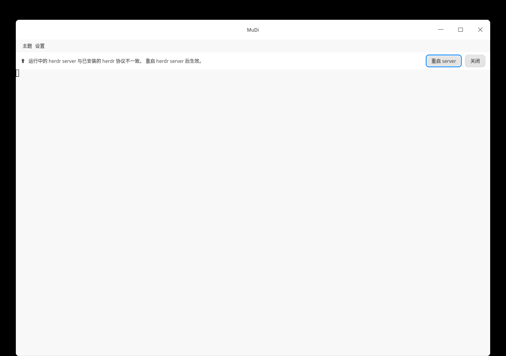
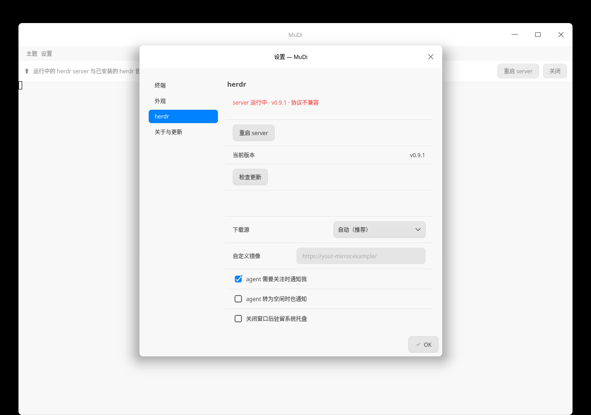

# MuDi 牧笛

**MuDi** is a desktop cockpit for [herdr](https://github.com/herdrdev/herdr) —
the terminal workspace manager for running AI coding agents. MuDi is for the
herder whose eyes shouldn't be glued to the terminal: it watches the flock,
calls you over when an agent needs you, and takes you straight to its side.

[](https://github.com/re2zero/mudi/actions/workflows/ci.yml)



herdr's own TUI remains the place to *operate* — MuDi adds everything that
happens **outside** the terminal window:

- **Desktop notifications with navigation.** When an agent blocks or finishes,
  you get a notification; clicking it (or its *View* button) raises MuDi and
  focuses that agent's pane. Agents are labelled by their project —
  `youqu (omp)` — so same-named agents stay distinguishable.
- **Tray presence.** Close the window and MuDi keeps watching (opt-in):
  the tray shows a live agent summary, blocked agents get one-click jump
  entries, and quitting — with or without stopping the herdr server — is a
  conscious, confirmed choice.
- **Server lifecycle, closed.** After a herdr update, the running server is
  one version behind and clients start failing. MuDi tracks the server via
  `herdr status`, tells you when a restart is needed, and walks you through
  it: confirmation → stop → automatic relaunch → the client reattaches in
  place.
- **Updates with mirrors.** herdr itself is updated from within MuDi, with
  concurrent download racing across GitHub mirrors for fast downloads in
  China, SHA-256 verification and atomic install. MuDi checks for its own
  updates too. On first run it even installs herdr for you — no terminal
  required.
- **Two faces, one app.** On deepin/UOS it speaks native DTK; anywhere else
  it falls back to a plain Qt window, so the same codebase builds on Linux
  and macOS.



## Install

Prebuilt binaries are attached to each
[release](https://github.com/re2zero/mudi/releases) (`mudi-<os>-<arch>`,
plus a portable `.tar.gz` per platform):

```sh
install -Dm755 mudi-linux-x86_64 ~/.local/bin/mudi
```

Make sure `~/.local/bin` is on your `PATH`. On first launch MuDi offers to
install the matching `herdr` release automatically.

Requirements: a running desktop environment with a system tray and a
freedesktop notification daemon (both optional — MuDi degrades gracefully
without them); Linux (x86_64, aarch64) or macOS.

## Build from source

```sh
sudo apt-get install --no-install-recommends \
  build-essential cmake pkg-config \
  qt6-base-dev qt6-tools-dev qt6-tools-dev-tools qt6-l10n-tools \
  qt6-5compat-dev libicu-dev libuchardet-dev libchardet-dev
cmake -B build -DCMAKE_BUILD_TYPE=Release
cmake --build build
./build/mudi
```

On deepin/UOS the DTK interface is enabled automatically. macOS builds use
Homebrew Qt (`brew install qt icu4c uchardet`) and get the generic shell.

## The name

A *Mudi* is a Hungarian herding dog — small, relentless, born to keep a flock
together. 牧笛 (*mùdí*, Mandarin for "shepherd's flute") sounds the same: the
tune that keeps the herd moving without the shepherd chasing every sheep.
Both fit: MuDi doesn't run your agents — it keeps them gathered and comes
running the moment one strays.

## 中文简介

**MuDi（牧笛）** 是 [herdr](https://github.com/herdrdev/herdr) 终端工作区管理器的桌面驾驶舱，为"放牧 AI agent"的人而做：眼睛不必黏在终端上。

- agent 阻塞或完成时推送桌面通知，点击即 raise 窗口并跳转到对应 pane；
- 支持关闭窗口驻留托盘：托盘实时显示 agent 概要，blocked 的 agent 一键直达；
- herdr 更新后引导一键重启 server（确认 → 停止 → 自动拉起并原地重连客户端）；
- 内置 herdr 更新器：GitHub 镜像并发竞速、SHA-256 校验、原子安装；MuDi 自身也支持在线更新检查，首次运行还会引导安装 herdr，全程无需终端；
- deepin/UOS 上自动启用 DTK 界面，其他平台回退纯 Qt，Linux 与 macOS 均可构建。

安装与构建方法见上文；发布页提供 `mudi-<os>-<arch>` 裸二进制与便携包。

## License

GPL-3.0 — see [LICENSE](LICENSE).
